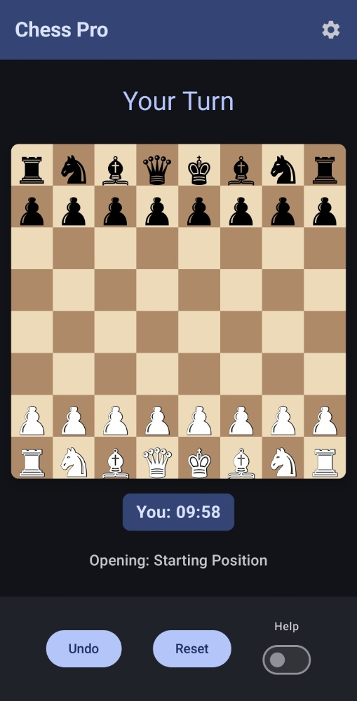

# Android Chess Game AI

**Android Chess Game AI** is a high-performance, native Android chess application built with **Kotlin** and **Jetpack Compose**. It features a custom-built AI engine optimized for mobile devices, offering a fluid and challenging experience for players of all levels.

---

## 🚀 Key Features

* **Custom AI Engine**: Features a sophisticated Minimax-based opponent with three distinct difficulty levels: Easy, Medium, and Hard.
* **Real-Time Opening Recognition**: Automatically identifies and displays classic chess openings as you play, such as the **London System**, **Sicilian Defense**, and **Ruy Lopez**.
* **Advanced Time Control**: Customizable player timers ranging from 3-minute blitz to 30-minute classical sessions.
* **Dynamic Help Mode**: Real-time visual indicators highlighting legal moves and identifying dangerous squares under immediate threat.
* **Strategic AI Openings**: Configure the AI to start with specific opening strategies to practice against particular lines.
* **Undo System**: Integrated move-rollback capability with a persistent counter to track your progress.
* **Tournament Standards**: Full support for complex rules including castling, pawn promotion (Queen, Rook, Bishop, Knight), and stalemate detection.

## 📸 Screenshots

<table style="width:100%">
  <tr>
    <th style="text-align:center">Gameplay</th>
  </tr>
  <tr>
    <td></td>
  </tr>
</table>
---

## 🧠 AI Logic & Algorithm

The "brain" of Android Chess Game AI is a recursive decision-making engine designed for efficiency and tactical depth.


### The Minimax Algorithm
The engine utilizes the **Minimax algorithm** with **Alpha-Beta Pruning**. It simulates thousands of potential future board states to a specified depth (e.g., 2-4 plies) and selects the move that maximizes the AI's advantage while assuming the player will make the best possible counter-moves.

### Board Evaluation Heuristics
Each board position is assigned a numerical score based on several factors:
1.  **Material Value**: Standard piece weighting (Pawn=10, Knight/Bishop=30, Rook=50, Queen=90, King=900).
2.  **Safety Protocols**: The engine includes "Queen Sacrifice Prevention" logic that heavily penalizes moves leaving the Queen on a square controlled by the opponent.
3.  **Positioning**: Hard difficulty utilizes deeper look-ahead to prioritize center control and king safety.

---

## 🛠️ Compilation & Deployment

### Local Environment (Ubuntu/Debian)
Ensure you have **Java 17** installed.
```bash
git clone [https://github.com/assix/Android-Chess-Game-AI.git](https://github.com/assix/Android-Chess-Game-AI.git)
cd Android-Chess-Game-AI
chmod +x gradlew
./gradlew assembleDebug
```
The compiled APK will be located at `app/build/outputs/apk/debug/app-debug.apk`.

### Google Colab (Cloud Build)
If you are away from your primary machine, you can compile the APK in the cloud:
1.  Open a new Colab notebook.
2.  Install OpenJDK 17 and set `JAVA_HOME`.
3.  Clone the repository, grant permissions to `gradlew`, and run `./gradlew assembleDebug`.
4.  Download the resulting file from `app/build/outputs/apk/debug/app-debug.apk`.

---
Developed by assix.
